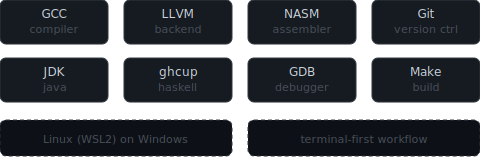

# Eduardo

CS student. Systems programmer. I like understanding how things actually work — not how someone else's abstraction tells me they work.

Most of what I write runs close to the hardware. I think in memory layouts and data pipelines, not frameworks. If I can't explain what's happening underneath, I don't consider it understood.

---

### Languages

**C** is where I live. Pointers, manual memory, the standard library. This is how I learned what a computer actually does. Im building data structures from scratch, writting interactive programs, and I'm comfortable enough that C feels like a first language rather than a tool I picked up.

**Zig** is where I'm heading. It fixes what C gets wrong without hiding what C gets right. No hidden control flow, real C interop, comptime instead of macros. I'm still early with it, but the design philosophy clicks with how I think.

**Java** I know from university. It works. That's about as enthusiastic as I'll get.

### Toolchain

LLVM shows up twice in my stack. It's the backend for both Rust and Zig. NASM is for when I want to see what the machine is really doing at the instruction level. x86-64.

### What I'm building

Right now I'm focused on getting deeper with Zig while keeping C sharp. Most of my projects are small, intentional things - the kind where the goal isn't a finished product but understanding a concept well enough to implement it from nothing.

I'm also writing x86-64 assembly. Not because anyone needs hand-written assembly in 2026, but because there shouldn't be a layer between me and the CPU that I don't understand.

### Beyond code

I care about **pure mathematics** — not the applied kind, the kind that describes why the universe is structured the way it is. Algebra, logic, the foundations. Programming is just one notation system for expressing those ideas.
